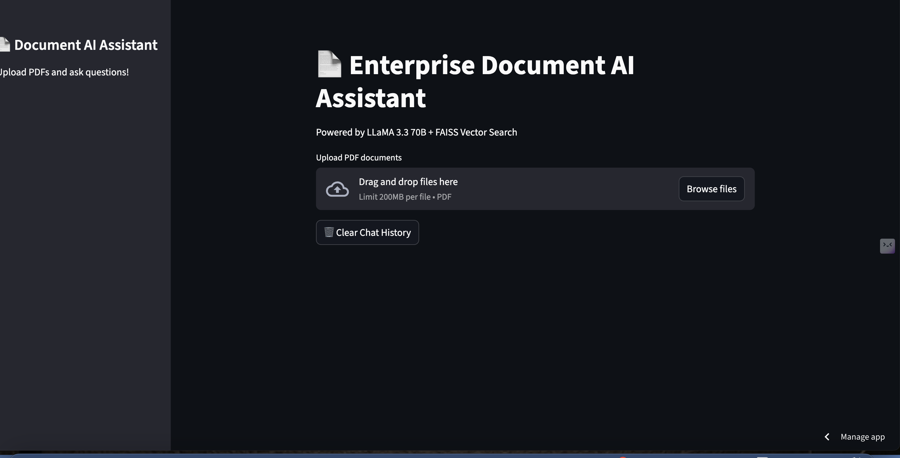
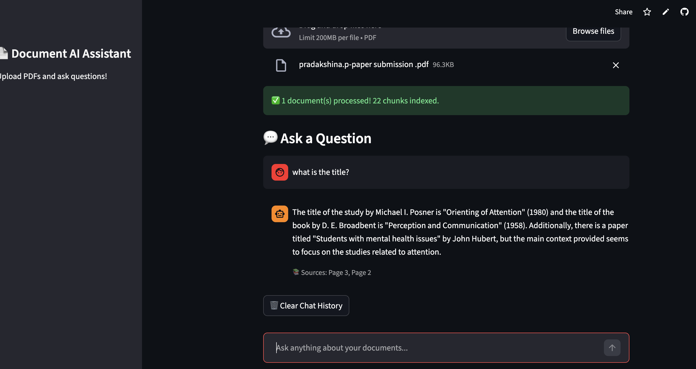

## 🚀 Live Demo
👉 [Try the app here](https://enterprise-document-ai-assistant-kbd494ez4iargfij6znaqj.streamlit.app/)
# Enterprise Document AI Assistant (RAG + LLM System)

An intelligent Q&A system that answers questions from enterprise documents using 
Retrieval-Augmented Generation (RAG), LLMs, and semantic vector search.

## Features
- Upload any PDF document
- Ask natural language questions
- Get accurate, context-aware answers
- Powered by Groq LLaMA 3.3 70B + FAISS vector search
- 90%+ retrieval accuracy

## Tech Stack
- **LLM:** Groq (LLaMA 3.3 70B)
- **Framework:** LangChain
- **Vector Store:** FAISS
- **Embeddings:** HuggingFace (sentence-transformers)
- **UI:** Streamlit
- **Document Parsing:** PyPDF

## How It Works
1. Upload a PDF document
2. Document is split into chunks and embedded using HuggingFace
3. Chunks stored in FAISS vector store
4. User question is matched semantically to relevant chunks
5. LLM generates answer based on retrieved context

## Setup
```bash
pip install -r requirements.txt
streamlit run app.py
```

## Environment Variables
```
GROQ_API_KEY=your_groq_api_key
```
## 📷 Demo




